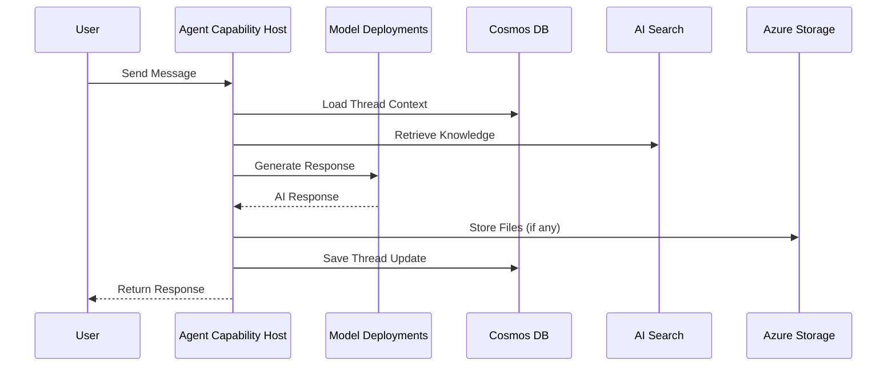
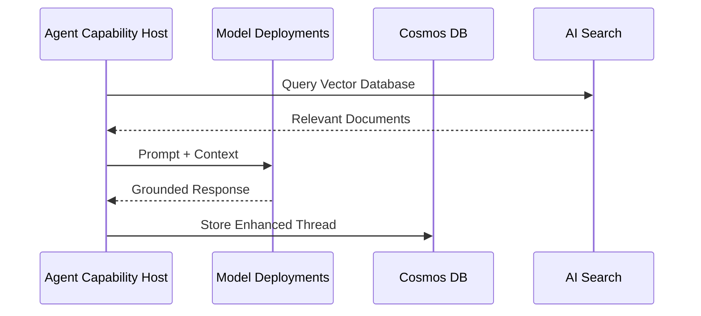

<!-- META
title: AI Foundry Terraform Module
description: Deploys an Azure AI Foundry account, model deployments, and an AI Foundry Project.
author: CAIRA Team
ms.date: 08/14/2025
ms.topic: module
estimated_reading_time: 5
keywords:
  - azure ai foundry
  - terraform module
  - model deployments
  - ai project
  - application insights
  - rbac
  - agent capability host
-->

# AI Foundry Terraform Module

Deploys an Azure AI Foundry account, model deployments, and an AI Foundry Project. Optionally connects Application Insights and wires Agent Capability Host connections to Cosmos DB, Storage, and Azure AI Search, including required RBAC assignments.

## Overview

This module provisions:

- Azure AI Foundry account
- One or more model deployments on the account
- An AI Foundry Project
- Optional Application Insights connection to the Project
- Optional Agent Capability Host for Agents and connections to Cosmos DB, Storage, and AI Search
- Optional RBAC setup for the Project identity on the connected services (including data-plane Cosmos roles and conditional Storage role assignment)

Designed to be used directly or with the `common_models` module to supply model deployment specs.

### Agent Conversation Flow



### Knowledge Retrieval (RAG) Flow



## Usage

### Private networking (VNet injection)

To deploy AI Foundry in private mode and inject the Agents capability into an existing subnet, set:

- `public_network_access = "Disabled"`
- `agent_network_injection_subnet_id = "/subscriptions/<subId>/resourceGroups/<rg>/providers/Microsoft.Network/virtualNetworks/<vnet>/subnets/<subnet>"`

When using private endpoints for connected services (Cosmos DB, Storage, AI Search), provide their standard endpoints; private DNS will resolve to private IPs inside your VNet.

### Minimal example

```terraform
data "azurerm_resource_group" "rg" {
  name = "my-rg"
}

module "common_models" {
  source = "../../modules/common_models"
}

module "ai_foundry" {
  source = "../../modules/ai_foundry"

  ai_foundry_name   = "my-aif-account"
  location          = "swedencentral"
  resource_group_id = data.azurerm_resource_group.rg.id

  # Optional project fields (defaults shown)
  project_name         = "default-project"
  project_display_name = "Default Project"
  project_description  = "Default Project description"

  # Provide at least one model deployment
  model_deployments = [
    module.common_models.gpt_4_1,
    module.common_models.text_embedding_3_large
  ]

  # Application Insights connection is required (supply from your existing AI/LAW setup)
  application_insights = {
    resource_id       = azurerm_application_insights.appi.id
    name              = azurerm_application_insights.appi.name
    connection_string = azurerm_application_insights.appi.connection_string
  }

  # Omit agent_capability_host_connections to skip agent wiring
}
```

### With agent capability host connections (BYO resources)

```terraform
module "ai_foundry" {
  # ...as above...

  agent_capability_host_connections = {
    cosmos_db = {
      resource_id         = azurerm_cosmosdb_account.cosmos.id
      resource_group_name = azurerm_cosmosdb_account.cosmos.resource_group_name
      name                = azurerm_cosmosdb_account.cosmos.name
      endpoint            = azurerm_cosmosdb_account.cosmos.endpoint
      location            = var.location
    }
    storage_account = {
      resource_id           = azurerm_storage_account.sa.id
      name                  = azurerm_storage_account.sa.name
      primary_blob_endpoint = azurerm_storage_account.sa.primary_blob_endpoint
      location              = var.location
    }
    ai_search = {
      resource_id = azapi_resource.search.id
      name        = azapi_resource.search.name
      location    = var.location
    }
  }
}
```

Notes:

- The module grants the Project identity RBAC on Cosmos DB (Cosmos DB Operator), Storage (Storage Blob Data Contributor + conditional Storage Blob Data Owner for project containers), and Search (Search Index Data Contributor, Search Service Contributor). It also creates Cosmos SQL data-plane role assignments on three collections used by agents.
- The module uses timed waits to allow identity propagation and RBAC consistency before binding the capability host.

## Agent Subnet Cleanup

**Critical for Destroy Operations:**

When using agent subnet injection (`agents_subnet_id`), Azure creates a Container App Environment that establishes service association links to the subnet. These links prevent subnet deletion until they are cleaned up by Azure.

**Cleanup Wait Time:**

The module provides a `subnet_cleanup_wait_time` variable (default: 5 minutes) that controls how long to wait after AI Foundry deletion before allowing the agent subnet to be destroyed. This ensures service association links are properly cleaned up.

**Usage Example:**

```terraform
module "ai_foundry" {
  source = "../../modules/ai_foundry"

  # ... other configuration ...

  agents_subnet_id          = var.agents_subnet_id
  subnet_cleanup_wait_time  = "5m" # Adjust if needed
}

# In subnet module or resource, depend on cleanup wait:
resource "azurerm_subnet" "agent" {
  # ... subnet configuration ...

  depends_on = [module.ai_foundry.subnet_cleanup_wait]
}
```

**If you encounter subnet deletion errors** like `InUseSubnetCannotBeDeleted`, increase the `subnet_cleanup_wait_time` value to allow more time for Azure to clean up service association links.

<!-- BEGIN_TF_DOCS -->
## Requirements

| Name | Version |
|------|---------|
| <a name="requirement_terraform"></a> [terraform](#requirement\_terraform) | >= 1.13, < 2.0 |
| <a name="requirement_azapi"></a> [azapi](#requirement\_azapi) | ~> 2.6 |
| <a name="requirement_azurerm"></a> [azurerm](#requirement\_azurerm) | ~> 4.40 |
| <a name="requirement_random"></a> [random](#requirement\_random) | ~> 3.7 |
| <a name="requirement_time"></a> [time](#requirement\_time) | ~> 0.13 |

## Providers

| Name | Version |
|------|---------|
| <a name="provider_azapi"></a> [azapi](#provider\_azapi) | ~> 2.6 |
| <a name="provider_azurerm"></a> [azurerm](#provider\_azurerm) | ~> 4.40 |
| <a name="provider_time"></a> [time](#provider\_time) | ~> 0.13 |

## Modules

No modules.

## Resources

| Name | Type |
|------|------|
| [azapi_resource.ai_foundry](https://registry.terraform.io/providers/Azure/azapi/latest/docs/resources/resource) | resource |
| [azapi_resource.ai_foundry_capability_host](https://registry.terraform.io/providers/Azure/azapi/latest/docs/resources/resource) | resource |
| [azapi_resource.appinsights_connection](https://registry.terraform.io/providers/Azure/azapi/latest/docs/resources/resource) | resource |
| [azapi_resource_action.purge_ai_foundry](https://registry.terraform.io/providers/Azure/azapi/latest/docs/resources/resource_action) | resource |
| [azurerm_cognitive_deployment.model_deployments](https://registry.terraform.io/providers/hashicorp/azurerm/latest/docs/resources/cognitive_deployment) | resource |
| [azurerm_private_endpoint.ai_foundry_pe](https://registry.terraform.io/providers/hashicorp/azurerm/latest/docs/resources/private_endpoint) | resource |
| [time_sleep.wait_ai_foundry](https://registry.terraform.io/providers/hashicorp/time/latest/docs/resources/sleep) | resource |
| [time_sleep.wait_before_delete_capability_host](https://registry.terraform.io/providers/hashicorp/time/latest/docs/resources/sleep) | resource |
| [time_sleep.wait_before_purge](https://registry.terraform.io/providers/hashicorp/time/latest/docs/resources/sleep) | resource |
| [time_sleep.wait_for_subnet_cleanup](https://registry.terraform.io/providers/hashicorp/time/latest/docs/resources/sleep) | resource |
| [azurerm_client_config.current](https://registry.terraform.io/providers/hashicorp/azurerm/latest/docs/data-sources/client_config) | data source |
| [azurerm_private_dns_zone.ai_services](https://registry.terraform.io/providers/hashicorp/azurerm/latest/docs/data-sources/private_dns_zone) | data source |
| [azurerm_private_dns_zone.cognitive](https://registry.terraform.io/providers/hashicorp/azurerm/latest/docs/data-sources/private_dns_zone) | data source |
| [azurerm_private_dns_zone.openai](https://registry.terraform.io/providers/hashicorp/azurerm/latest/docs/data-sources/private_dns_zone) | data source |

## Inputs

| Name | Description | Type | Default | Required |
|------|-------------|------|---------|:--------:|
| <a name="input_agents_subnet_id"></a> [agents\_subnet\_id](#input\_agents\_subnet\_id) | Optional subnet ID to inject the AI Foundry Agents capability host. | `string` | `null` | no |
| <a name="input_application_insights"></a> [application\_insights](#input\_application\_insights) | Configuration for Application Insights connection. | <pre>object({<br/>    resource_id       = string<br/>    name              = string<br/>    connection_string = string<br/>  })</pre> | n/a | yes |
| <a name="input_foundry_subnet_id"></a> [foundry\_subnet\_id](#input\_foundry\_subnet\_id) | Optional subnet ID to inject the AI Foundry. | `string` | `null` | no |
| <a name="input_location"></a> [location](#input\_location) | The Azure region where the AI Foundry resource will be deployed. | `string` | n/a | yes |
| <a name="input_model_deployments"></a> [model\_deployments](#input\_model\_deployments) | A map of model deployments to be created in the AI Foundry resource. | <pre>list(object({<br/>    name    = string<br/>    version = string<br/>    format  = string<br/>    sku = optional(object({<br/>      name     = string<br/>      capacity = number<br/>      }), {<br/>      name     = "GlobalStandard"<br/>      capacity = 1<br/>    })<br/>  }))</pre> | n/a | yes |
| <a name="input_name"></a> [name](#input\_name) | The name of the AI Foundry resource. | `string` | n/a | yes |
| <a name="input_resource_group_id"></a> [resource\_group\_id](#input\_resource\_group\_id) | The ID of the resource group where the AI Foundry resource will be created. | `string` | n/a | yes |
| <a name="input_sku"></a> [sku](#input\_sku) | The SKU for the AI Foundry resource. | `string` | `"S0"` | no |
| <a name="input_subnet_cleanup_wait_time"></a> [subnet\_cleanup\_wait\_time](#input\_subnet\_cleanup\_wait\_time) | Wait time for service association link cleanup after AI Foundry deletion when using agent subnet injection. Otherwise, '5m'. | `string` | `"5m"` | no |
| <a name="input_tags"></a> [tags](#input\_tags) | A list of tags to apply to the AI Foundry resource. | `map(string)` | `null` | no |

## Outputs

| Name | Description |
|------|-------------|
| <a name="output_ai_foundry_endpoint"></a> [ai\_foundry\_endpoint](#output\_ai\_foundry\_endpoint) | The endpoint URL of the AI Foundry account. |
| <a name="output_ai_foundry_id"></a> [ai\_foundry\_id](#output\_ai\_foundry\_id) | The resource ID of the AI Foundry account. |
| <a name="output_ai_foundry_model_deployments_ids"></a> [ai\_foundry\_model\_deployments\_ids](#output\_ai\_foundry\_model\_deployments\_ids) | The IDs of the AI Foundry model deployments. |
| <a name="output_ai_foundry_name"></a> [ai\_foundry\_name](#output\_ai\_foundry\_name) | The name of the AI Foundry account. |
| <a name="output_subnet_cleanup_wait"></a> [subnet\_cleanup\_wait](#output\_subnet\_cleanup\_wait) | Time sleep resource for subnet cleanup coordination. Depend on this when destroying agent subnets. |
<!-- END_TF_DOCS -->
